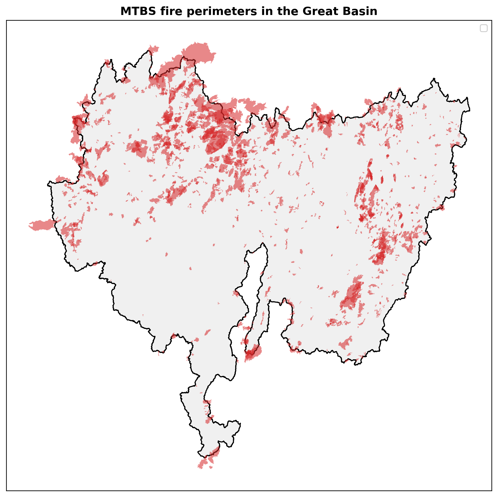
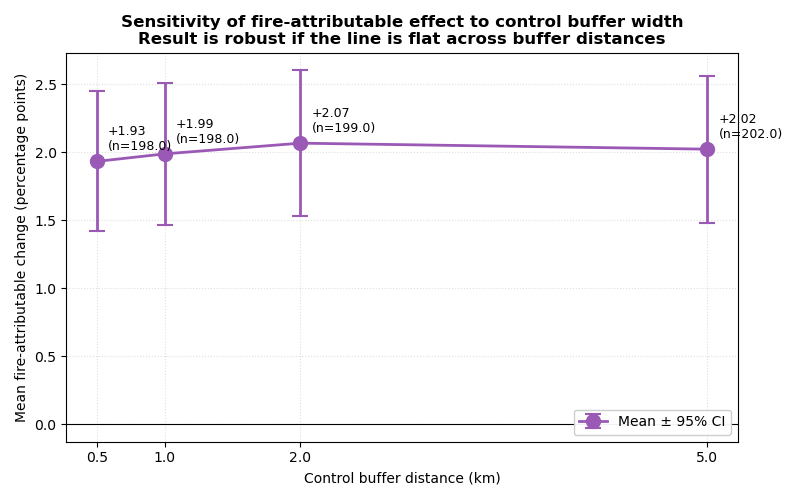
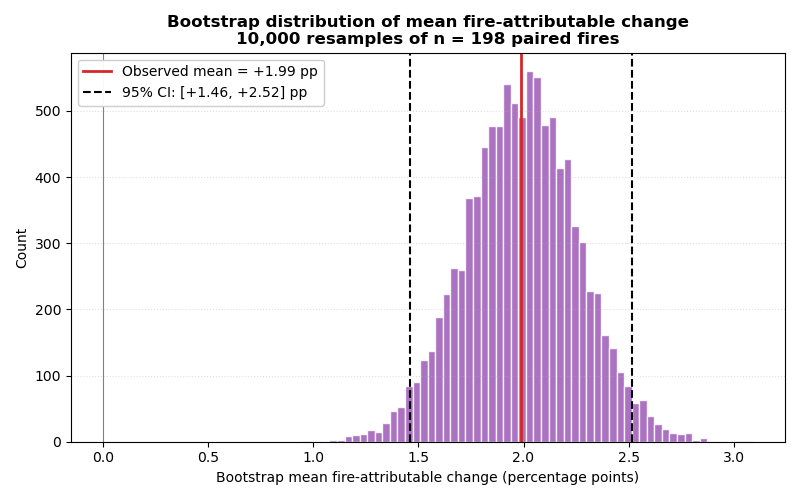

# Post-fire Annual Herbaceous Cover in the Great Basin

## Methods

### Study area and data

The Great Basin (USGS hydrologic unit 16) is a closed-basin region of approximately 367,000 km² spanning Nevada, western Utah, southeastern Oregon, and adjacent portions of California, Idaho, and Wyoming. We restricted all analyses to this polygon as released by the USGS Watershed Boundary Dataset.

We used two primary datasets. Fire perimeters and ignition dates came from the Monitoring Trends in Burn Severity database (MTBS; Eidenshink et al., 2007), which provides 30 m perimeters for fires ≥ 1,000 acres in the western U.S. from 1984 to the present. Annual herbaceous cover came from the Rangeland Condition Monitoring, Assessment, and Projection product (RCMAP, version 6; Rigge et al., 2021), a 30 m fractional cover time series spanning 1985–2024. RCMAP rasters were exported for the Great Basin via Google Earth Engine and reprojected to USA Contiguous Albers Equal Area (EPSG:5070) to preserve area-based summaries. Annual herbaceous cover in the Great Basin is dominated by invasive annual grasses, principally cheatgrass (*Bromus tectorum*), which is the ecologically dominant species across roughly one-third of the basin (Knapp, 1996; Pilliod et al., 2017; Bradley et al., 2018). We therefore treat RCMAP annual herbaceous cover as a defensible proxy for invasive annual grass abundance.

We retained MTBS perimeters intersecting the Great Basin polygon (n = 1,449 after dropping records with missing ignition dates or invalid geometries; **Fig. 1**). To accommodate a multi-year pre/post comparison window, we restricted the analysis to fires igniting in 2014–2018, ensuring two years of RCMAP coverage on each side of the ignition year, yielding 202 fires.

### Pre- and post-fire change

For each eligible fire, we computed the mean annual herbaceous cover inside the burn perimeter for the two years preceding ignition (pre-fire) and the two years following ignition (post-fire), excluding RCMAP no-data pixels. Use of a two-year mean reduces sensitivity to single-year weather variability while retaining sample size. The change in cover for each fire was defined as

$$\Delta_{\text{burned}} = \text{mean(post-fire window)} - \text{mean(pre-fire window)}$$

To distinguish a fire-attributable signal from broader landscape or climate trends, we constructed an unburned control ring around each fire as the difference between a 1 km buffer of the perimeter and the perimeter itself. To avoid contaminating controls with adjacent burns, we further excluded any pixels falling inside other MTBS perimeters and clipped each ring to the Great Basin polygon. We extracted pre- and post-fire mean cover inside each control ring using the same windows, yielding a paired control change Δ_control. The fire-attributable change for each fire was

$$\Delta_{\text{attributable}} = \Delta_{\text{burned}} - \Delta_{\text{control}}$$

Of the 202 fires, 198 had valid paired measurements (four were dropped because their control rings were entirely overlapped by other fires).

### Statistical analysis

We tested whether the burned-area change exceeded the paired control change using a paired t-test and a Wilcoxon signed-rank test as a non-parametric complement. To stratify the result, we report the fire-attributable change by ignition year and by fire size class (small: < 10 km²; medium: 10–50 km²; large: ≥ 50 km²), with one-sample t-tests against zero within each stratum.

We assessed robustness in two ways. First, we re-ran the burned-vs-control comparison at control ring widths of 500 m, 1 km, 2 km, and 5 km to confirm that the result is not an artifact of the buffer choice. Second, we computed a bootstrap 95% confidence interval on the mean fire-attributable change by resampling the 198 paired observations with replacement 10,000 times and taking the 2.5th and 97.5th percentiles of the resulting distribution.

All analyses were performed in Python 3.11 using GeoPandas, Rasterio, NumPy, pandas, and SciPy. Figures were produced with Matplotlib at 300 DPI.

---

## Results

### Post-fire change inside burn perimeters

Across 202 fires igniting in the Great Basin between 2014 and 2018, mean annual herbaceous cover increased from 14.41% in the two-year pre-fire window to 16.38% in the two-year post-fire window — a mean change of +1.98 percentage points (pp; SD = 4.86, range −12.84 to +16.61). 138 of 202 fires (68%) showed an increase, while 53 (26%) showed a decrease (**Fig. 2a**). Fires with low pre-fire cover tended to show the largest absolute increases, while fires already at high pre-fire cover changed little (**Fig. 2b**). The post-fire response was geographically widespread across the basin, with the strongest increases concentrated in the northern Great Basin (**Fig. 2c**).

### Burned vs unburned comparison

Of the 202 eligible fires, 198 had valid paired measurements in both the burn perimeter and the surrounding 1 km unburned control ring. Mean change inside burn perimeters (+1.91 pp) was substantially greater than mean change in paired controls (−0.08 pp), giving a mean fire-attributable change of **+1.99 pp**. The difference was highly significant under both tests (paired t = 7.44, p < 0.001; Wilcoxon W = 3,587, p < 0.001). 142 of 198 fires (72%) showed a larger change inside the perimeter than in the surrounding control (**Fig. 3a**), and the distribution of fire-attributable change was clearly shifted to the right of zero (**Fig. 3b**).

### Stratification by year and fire size

The fire-attributable response varied substantially by ignition year (**Table 1**, **Fig. 4a**). Fires igniting in 2014–2017 each showed significant positive fire-attributable change (mean +1.93 to +3.97 pp; all p ≤ 0.004), but fires igniting in 2018 showed no detectable response (mean −0.21 pp, p = 0.67). The 2018 post-fire window (2019–2020) coincided with relatively dry conditions across the basin, which likely suppressed the herbaceous response.

**Table 1.** Fire-attributable change by ignition year. One-sample *t*-test against zero.

| Ignition year | n  | Mean (pp) | Median (pp) | SD (pp) | *t* | *p* |
|--------------:|---:|----------:|------------:|--------:|----:|----:|
| 2014          | 15 | +3.05     | +2.63       | 3.46    | 3.41 | 0.004 |
| 2015          |  9 | +3.97     | +2.13       | 4.80    | 2.48 | 0.038 |
| 2016          | 43 | +3.92     | +3.05       | 3.74    | 6.87 | < 0.001 |
| 2017          | 80 | +1.93     | +2.06       | 3.11    | 5.55 | < 0.001 |
| 2018          | 51 | −0.21     | +0.12       | 3.52    | −0.43 | 0.668 |

In contrast, the response was consistent across fire size classes (**Table 2**, **Fig. 4b**). Small (< 10 km²; n = 77), medium (10–50 km²; n = 83), and large (≥ 50 km²; n = 38) fires all showed significant positive fire-attributable change of similar magnitude (+1.67 to +2.09 pp; all p ≤ 0.002), indicating that the basin-wide signal is not driven disproportionately by a small number of large fires.

**Table 2.** Fire-attributable change by fire size class. One-sample *t*-test against zero.

| Size class           | n  | Mean (pp) | Median (pp) | SD (pp) | *t* | *p* |
|----------------------|---:|----------:|------------:|--------:|----:|----:|
| Small (< 10 km²)     | 77 | +2.03     | +1.83       | 4.03    | 4.42 | < 0.001 |
| Medium (10–50 km²)   | 83 | +2.09     | +1.23       | 3.81    | 5.00 | < 0.001 |
| Large (≥ 50 km²)     | 38 | +1.67     | +1.94       | 3.08    | 3.34 | 0.002 |

### Robustness

The fire-attributable effect was insensitive to the choice of control buffer width. Mean fire-attributable change ranged narrowly from +1.93 pp at a 500 m buffer to +2.07 pp at 2 km, and remained highly significant (p < 0.001) at all four buffer widths tested (**Table 3**, **Fig. 5**). A non-parametric bootstrap (10,000 resamples, n = 198) gave a mean fire-attributable change of +1.99 pp with a 95% confidence interval of [+1.46, +2.52] pp (**Fig. 6**). The lower bound of the interval is well above zero, confirming a positive fire effect under the bootstrap as well.

**Table 3.** Sensitivity of the fire-attributable effect to control-ring buffer width.

| Buffer | n   | Mean (pp) | SE (pp) | *t* | *p* |
|-------:|----:|----------:|--------:|----:|----:|
| 500 m  | 198 | +1.93     | 0.26    | 7.35 | < 0.001 |
| 1 km   | 198 | +1.99     | 0.27    | 7.44 | < 0.001 |
| 2 km   | 199 | +2.07     | 0.27    | 7.57 | < 0.001 |
| 5 km   | 202 | +2.02     | 0.28    | 7.33 | < 0.001 |

---

## Discussion

Across 198 fires igniting in the Great Basin between 2014 and 2018, burned areas showed a mean fire-attributable increase in annual herbaceous cover of +1.99 percentage points relative to paired unburned controls (95% CI [+1.46, +2.52]; paired *t* = 7.44, *p* < 0.001). The control rings showed essentially no change over the same windows, indicating that the burned-area increase cannot be attributed to broader regional climate or landscape trends. Seventy-two percent of individual fires showed a larger increase inside the perimeter than in the surrounding control. The result was robust to the choice of control buffer width across a tenfold range (500 m to 5 km), and stable across small, medium, and large fire size classes. We interpret this as direct, landscape-scale evidence that wildfire promotes annual herbaceous expansion in the Great Basin.

This finding is consistent with the long-recognized grass–fire feedback in semi-arid western rangelands, in which invasive annual grasses — principally cheatgrass (*Bromus tectorum*) — colonize burn scars more rapidly than native perennials and, by adding fine fuels, increase the probability and severity of subsequent fires (D'Antonio and Vitousek, 1992; Brooks et al., 2004; Balch et al., 2013). The +1.99 pp average effect we estimate is modest in absolute terms but biologically meaningful: post-fire annual herbaceous expansion of even a few percentage points can shift fuel structure enough to perpetuate the feedback loop, particularly when integrated across the > 5,000 km² of land burned in our 198-fire sample. That the effect is not concentrated in large fires — small fires showed comparable per-area responses — suggests the mechanism operates broadly rather than being confined to high-severity, high-extent disturbances.

The most striking feature of our stratified results is the year-to-year variation. Fires igniting in 2014–2017 showed significant positive fire-attributable change (means of +1.93 to +3.97 pp), but fires igniting in 2018 showed no detectable response (mean −0.21 pp, *p* = 0.67). The post-fire window for 2018 fires (2019–2020) coincided with widespread drought across the Great Basin, which likely suppressed the establishment and growth of post-fire annuals. Rather than weakening the headline result, this variation reinforces an emerging point in the literature (Pilliod et al., 2017; Bradley et al., 2018): the magnitude of the post-fire annual grass response depends not only on the fire itself but on the moisture conditions of the years that immediately follow it. A management implication is that fires occurring before wet years may amplify invasion more strongly than fires occurring before dry years, with consequences for prioritizing post-fire restoration effort.

Several limitations bound the scope of inference. First, our response variable is RCMAP annual herbaceous cover, not a cheatgrass-specific layer. We treat it as a proxy for invasive annual grass abundance because annual herbaceous cover in the post-fire Great Basin is dominated by cheatgrass and other invasive annuals, but the proxy is imperfect: native annuals contribute some signal, and we cannot directly attribute the fire-driven change to cheatgrass per se. Second, the two-year pre/post window balances signal stability against sample size but cannot resolve longer-term trajectories — some post-fire annual grass responses develop over five or more years. Third, MTBS records only fires ≥ 1,000 acres, so our inference is restricted to landscape-scale events; smaller burns are not represented. Fourth, we did not stratify by burn severity in this analysis, although the MTBS severity rasters are available; whether high-severity burns produce stronger annual grass responses than low-severity burns remains an open question for follow-up work. Finally, our control rings, while a defensible match for local landscape and climate context, are not matched on edaphic or topographic variables; rigorous environmental matching could refine the attributable-change estimate.

Despite these limitations, the central result is clear and well supported. Wildfire in the Great Basin produces a measurable, statistically robust, geographically widespread increase in annual herbaceous cover that exceeds change in adjacent unburned land, and that magnitude is moderated by post-fire climate. This places direct empirical weight behind the cheatgrass–fire feedback model at a basin-wide scale, and underscores the role of post-fire weather as a contingent factor that should be incorporated into both ecological understanding and post-fire management decisions.

---

## Conclusion

This study provides direct, basin-wide empirical evidence that wildfire promotes annual herbaceous expansion in the Great Basin. Across 198 fires from 2014 to 2018, post-fire annual herbaceous cover inside burn perimeters increased by an average of +1.99 percentage points relative to paired unburned controls — a result that was statistically robust, insensitive to control buffer width, and consistent across fire size classes. The fire-attributable signal was, however, contingent on post-fire climate: fires followed by drought years showed no detectable response, suggesting that the magnitude of post-fire invasion is moderated by short-term moisture conditions and is therefore not deterministic.

These results corroborate the long-hypothesized cheatgrass–fire feedback at the landscape scale and add a quantitative, climate-contingent dimension to it. For management, the implication is that post-fire restoration effort may be most consequential when applied to burns that occur in advance of wetter years, when the invasion potential is greatest. For research, the next priorities are to extend the post-fire window beyond two years, incorporate burn severity into the analysis, and replicate the framework across other arid and semi-arid biomes where annual grass invasion threatens native rangelands.

---

## References

Balch, J. K., Bradley, B. A., D'Antonio, C. M., and Gómez-Dans, J. (2013). Introduced annual grass increases regional fire activity across the arid western USA (1980–2009). *Global Change Biology*, 19(1), 173–183.

Bradley, B. A., Curtis, C. A., Fusco, E. J., Abatzoglou, J. T., Balch, J. K., Dadashi, S., and Tuanmu, M. N. (2018). Cheatgrass (*Bromus tectorum*) distribution in the intermountain Western United States and its relationship to fire frequency, seasonality, and ignitions. *Biological Invasions*, 20(6), 1493–1506.

Brooks, M. L., D'Antonio, C. M., Richardson, D. M., Grace, J. B., Keeley, J. E., DiTomaso, J. M., Hobbs, R. J., Pellant, M., and Pyke, D. (2004). Effects of invasive alien plants on fire regimes. *BioScience*, 54(7), 677–688.

D'Antonio, C. M., and Vitousek, P. M. (1992). Biological invasions by exotic grasses, the grass/fire cycle, and global change. *Annual Review of Ecology and Systematics*, 23(1), 63–87.

Eidenshink, J., Schwind, B., Brewer, K., Zhu, Z. L., Quayle, B., and Howard, S. (2007). A project for monitoring trends in burn severity. *Fire Ecology*, 3(1), 3–21.

Knapp, P. A. (1996). Cheatgrass (*Bromus tectorum* L.) dominance in the Great Basin Desert: history, persistence, and influences to human activities. *Global Environmental Change*, 6(1), 37–52.

Pilliod, D. S., Welty, J. L., and Arkle, R. S. (2017). Refining the cheatgrass–fire cycle in the Great Basin: precipitation timing and fine fuel composition predict wildfire trends. *Ecology and Evolution*, 7(19), 8126–8151.

Rigge, M., Homer, C., Cleeves, L., Meyer, D. K., Bunde, B., Shi, H., Xian, G., Schell, S., and Bobo, M. (2021). Quantifying western U.S. rangelands as fractional components with multi-resolution remote sensing and in situ data. *Remote Sensing*, 13(22), 4631.
